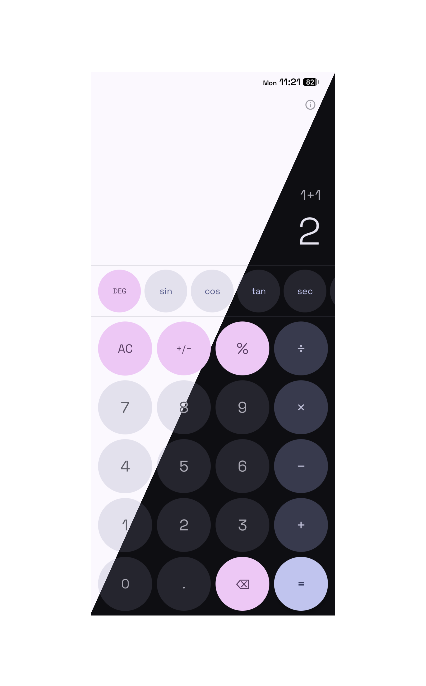

# Calculator

A Simple, clean calculator app for Android built with Kotlin and Jetpack Compose.



## Features

| features | what it does |
|-|-|
| **Standard arithmetic** | addition, subtraction, multiplication, division |
| **Live preview** | result updates as you type a valid expression |
| **Operator chaining** | chain operations with correct precedence (BODMAS) |
| **Sign toggle (+/−)** | negate the current number |
| **Scientific Calculator** | Includes trignometric functions, inverse trignometric functions, sqrt, factorial, logarithms, natural logarithm, exponentials, exponentials with base e |

## Installation

> [!NOTE]
> Android versions from 8 to 16 are currently supported

- goto [latest release](https://github.com/quantumvoid0/calculator/releases/latest) and download the [calculator.apk](https://github.com/quantumvoid0/calculator/releases/download/v1.0/calculator.apk), after doing so open `calculator.apk` to install it.

## Building yourself for development

Requirements:
- JDK 17
- Android SDK (API 36)

```bash
git clone https://github.com/quantumvoid0/calculator
cd calculator
gradle wrapper --gradle-version 8.14.2
./gradlew assembleDebug
adb install app/build/outputs/apk/debug/app-debug.apk
```
